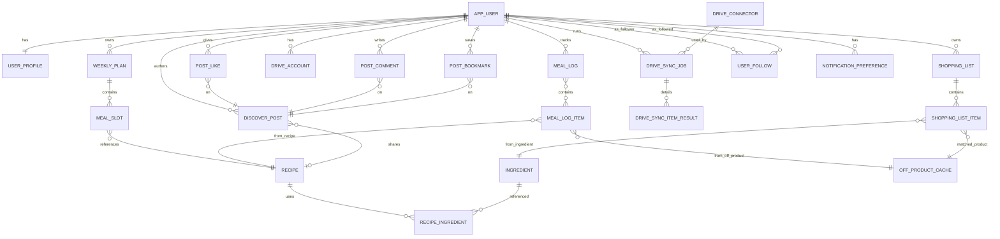

# Conception BDD — NutriFlow

Ce document propose une base de donnees PostgreSQL coherente avec :
- la vision produit (profil ADN culinaire, agenda, recettes, liste de courses),
- l'integration Open Food Facts (nutrition de reference),
- la future extension navigateur multi-drive (synchronisation panier).

## 1) Principes de modelisation

- Une source de verite metier cote NutriFlow (users, planning, recettes, shopping).
- Les donnees Open Food Facts restent des references externes : on stocke un **snapshot utile** et un horodatage de synchro.
- Le module drive doit etre **multi-enseignes** via un modele connecteur + jobs de sync.
- Le front consomme des DTO stables : la BDD peut evoluer sans casser les payloads API.

## 2) Macro domaines

1. Identite & profil utilisateur
2. Recettes & ingredients
3. Planning repas (agenda)
4. Journal nutrition / consommation
5. Liste de courses
6. Catalogue produit externe (OFF)
7. Synchronisation drive (extension + connecteurs)
8. Social & Decouvrir (posts, likes, commentaires, abonnements)
9. Notifications & preferences

## 3) Schema conceptuel (ERD)

## 4) Tables coeur (proposition v1)

## 4.1 Utilisateur & profil

### `app_user`
- `id` (uuid, pk)
- `email` (varchar, unique, not null)
- `password_hash` (varchar, nullable si OAuth)
- `status` (varchar: active, pending, disabled)
- `created_at`, `updated_at`

### `user_profiles`
- `user_id` (uuid, pk/fk -> app_user.id)
- `display_name` (varchar)
- `subtitle` (varchar : ex. "Culinary Alchemist & Wellness Guide")
- `bio` (text)
- `avatar_url` (varchar)
- `gender` (HOMME / FEMME / AUTRE)
- `birth_date` (date)
- `height_cm` (numeric)
- `activity_level` (SEDENTAIRE / ACTIF / TRES_ACTIF)
- `goal` (PERTE / GAIN / MAINTIEN)
- `cooking_level` (DEBUTANT / INITIE / INTERMEDIAIRE / AVANCE)
- `diet_preferences` (jsonb : ex. ["vegetarian","gluten_free","paleo"])
- `intolerances` (jsonb : ex. ["lactose","arachides"])
- `allergies` (jsonb)
- `kcal_goal`, `protein_goal_g`, `carb_goal_g`, `fat_goal_g` (integer, nullable)
- `hydration_goal_ml` (integer, nullable)
- `updated_at`

## 4.2 Recettes & ingredients

### `recipes`
- `id` (uuid, pk)
- `author_user_id` (uuid, fk -> app_user.id, nullable pour contenu systeme)
- `title`, `description`
- `image_url` (varchar, nullable)
- `category` (varchar : label éditorial libre, ex. "DÎNER LÉGER", "PROTÉINES MARINES")
- `season_tags` (jsonb : ex. ["printemps","ete"] — valeurs : printemps, ete, automne, hiver)
- `difficulty` (FACILE / MOYEN / DIFFICILE)
- `prep_minutes`, `cook_minutes`, `total_minutes`
- `kcal_per_serving`, `protein_g`, `carb_g`, `fat_g` (nullable)
- `servings`
- `is_public` (bool)
- `created_at`, `updated_at`

### `ingredient`
- `id` (uuid, pk)
- `name` (varchar, not null)
- `default_unit` (g, ml, piece, etc.)
- `created_at`, `updated_at`

### `recipe_ingredient`
- `recipe_id` (uuid, fk -> recipe.id)
- `ingredient_id` (uuid, fk -> ingredient.id)
- `quantity` (numeric)
- `unit` (varchar)
- `preparation_note` (varchar, nullable)
- **PK composite** (`recipe_id`, `ingredient_id`)

## 4.3 Planning & agenda

### `weekly_plan`
- `id` (uuid, pk)
- `user_id` (uuid, fk -> app_user.id)
- `week_start_date` (date, not null)
- `status` (draft, active, archived)
- `created_at`, `updated_at`
- **unique** (`user_id`, `week_start_date`)

### `meal_slot`
- `id` (uuid, pk)
- `weekly_plan_id` (uuid, fk -> weekly_plan.id)
- `day_of_week` (1..7)
- `meal_type` (breakfast, lunch, dinner, snack)
- `location_type` (home, restaurant, outside)
- `recipe_id` (uuid, fk -> recipe.id, nullable)
- `note` (varchar, nullable)
- `created_at`, `updated_at`
- index recommande : (`weekly_plan_id`, `day_of_week`, `meal_type`)

## 4.4 Journal conso (dashboard energie)

### `meal_log`
- `id` (uuid, pk)
- `user_id` (uuid, fk -> app_user.id)
- `log_date` (date, not null)
- `created_at`, `updated_at`
- **unique** (`user_id`, `log_date`)

### `meal_log_item`
- `id` (uuid, pk)
- `meal_log_id` (uuid, fk -> meal_log.id)
- `meal_type` (breakfast, lunch, dinner, snack)
- `source_type` (recipe, off_product, manual)
- `recipe_id` (uuid, nullable)
- `off_product_id` (uuid, nullable)
- `quantity` (numeric)
- `unit` (varchar)
- `kcal`, `protein_g`, `carb_g`, `fat_g` (snapshot pour historique)
- `consumed_at` (timestamp, nullable)

## 4.5 Shopping list

### `shopping_list`
- `id` (uuid, pk)
- `user_id` (uuid, fk -> app_user.id)
- `week_start_date` (date, nullable)
- `status` (draft, ready, syncing, synced, partial, failed)
- `created_at`, `updated_at`

### `shopping_list_item`
- `id` (uuid, pk)
- `shopping_list_id` (uuid, fk -> shopping_list.id)
- `ingredient_id` (uuid, nullable)
- `label` (varchar, not null)
- `quantity` (numeric, nullable)
- `unit` (varchar, nullable)
- `is_checked` (bool default false)
- `off_product_id` (uuid, nullable)
- `match_confidence` (numeric(5,2), nullable)
- `substitution_json` (jsonb, nullable)
- `created_at`, `updated_at`

## 4.6 Open Food Facts (cache de reference)

### `off_product_cache`
- `id` (uuid, pk)
- `barcode` (varchar, unique, not null)
- `product_name`
- `brand`
- `quantity_text`
- `kcal_100g`, `protein_100g`, `carb_100g`, `fat_100g`, `salt_100g`, `fiber_100g` (numeric, nullable)
- `raw_payload` (jsonb, nullable: pour debug ou enrichissement futur)
- `last_synced_at` (timestamp, not null)
- `source_license` (varchar, default 'ODbL')

## 4.7 Extension drive sync multi-enseignes

### `drive_connector`
- `id` (uuid, pk)
- `key` (varchar, unique: leclerc, carrefour, auchan, etc.)
- `display_name`
- `is_active` (bool)
- `created_at`, `updated_at`

### `drive_account`
- `id` (uuid, pk)
- `user_id` (uuid, fk -> app_user.id)
- `connector_id` (uuid, fk -> drive_connector.id)
- `external_account_ref` (varchar, nullable)
- `status` (connected, expired, blocked)
- `last_success_sync_at` (timestamp, nullable)
- `created_at`, `updated_at`
- **unique** (`user_id`, `connector_id`)

### `drive_sync_job`
- `id` (uuid, pk)
- `user_id` (uuid, fk -> app_user.id)
- `connector_id` (uuid, fk -> drive_connector.id)
- `shopping_list_id` (uuid, fk -> shopping_list.id)
- `trigger_source` (web_app, extension, api)
- `status` (queued, running, partial, success, failed, cancelled)
- `started_at`, `finished_at`
- `error_summary` (text, nullable)
- `created_at`

### `drive_sync_item_result`
- `id` (uuid, pk)
- `job_id` (uuid, fk -> drive_sync_job.id)
- `shopping_list_item_id` (uuid, fk -> shopping_list_item.id)
- `status` (added, substituted, not_found, failed, skipped)
- `external_product_ref` (varchar, nullable)
- `message` (varchar, nullable)
- `created_at`

## 4.8 Social & Decouvrir

### `discover_posts`
- `id` (uuid, pk)
- `author_user_id` (uuid, fk -> app_user.id, not null)
- `title` (varchar, not null)
- `body` (text, not null)
- `image_url` (varchar, nullable)
- `type` (varchar: RECIPE_SHARE, TIP, EDITORIAL, USER_POST)
- `is_curated` (bool, default false)
- `share_count` (integer, default 0 — compteur dénormalisé, incrémenté côté service)
- `recipe_id` (uuid, fk -> recipe.id, nullable — si le post partage une recette)
- `created_at`, `updated_at`
- index : `(author_user_id)`, `(created_at)`

### `post_likes`
- `user_id` (uuid, fk -> app_user.id) + `post_id` (uuid, fk -> discover_posts.id) — **PK composite**
- `created_at`

### `post_comments`
- `id` (uuid, pk)
- `post_id` (uuid, fk -> discover_posts.id)
- `user_id` (uuid, fk -> app_user.id)
- `content` (text, not null)
- `created_at`
- index : `(post_id)`

### `post_bookmarks`
- `user_id` (uuid, fk -> app_user.id) + `post_id` (uuid, fk -> discover_posts.id) — **PK composite**
- `created_at`

### `user_follows`
- `follower_id` (uuid, fk -> app_user.id) + `followed_id` (uuid, fk -> app_user.id) — **PK composite**
- `created_at`
- index : `(follower_id)`, `(followed_id)`

> **Regles** : un utilisateur ne peut pas se suivre lui-meme (`follower_id != followed_id`). Le feed "Abonnements" filtre `discover_posts` par `author_user_id IN (SELECT followed_id FROM user_follows WHERE follower_id = ?)`.

## 4.9 Collections de recettes (Mes Listes)

### `recipe_collections`
- `id` (uuid, pk)
- `user_id` (uuid, fk -> app_user.id, not null)
- `title` (varchar, not null)
- `description` (text, nullable)
- `cover_image_url` (varchar, nullable)
- `is_public` (bool, default false)
- `created_at`, `updated_at`
- index : `(user_id)`

### `recipe_collection_items`
- `collection_id` (uuid, fk -> recipe_collections.id) + `recipe_id` (uuid, fk -> recipes.id) — **PK composite**
- `position` (integer, nullable — pour l'ordre d'affichage dans la grille)
- `added_at`

## 4.10 Abonnement Premium

### `user_subscriptions`
- `id` (uuid, pk)
- `user_id` (uuid, fk -> app_user.id)
- `plan` (FREE / PREMIUM / PREMIUM_ANNUAL)
- `status` (ACTIVE / EXPIRED / CANCELLED / TRIAL)
- `started_at` (timestamp, not null)
- `expires_at` (timestamp, nullable)
- `external_ref` (varchar, nullable — ex. Stripe subscription_id)
- `created_at`, `updated_at`
- index : `(user_id)`

> **Règle** : l'écran Paramètres affiche le bandeau d'alerte si `status = ACTIVE AND expires_at < NOW() + 7 days`.

## 4.11 Notifications

### `notification_preferences`
- `id` (uuid, pk)
- `user_id` (uuid, fk -> app_user.id)
- `channel` (push, email, in_app)
- `event_type` (meal_reminder, sunday_list, discover_news)
- `enabled` (bool)
- `schedule_json` (jsonb, nullable)
- **unique** (`user_id`, `channel`, `event_type`)

## 5) Regles de coherence (important)

- `meal_slot.location_type != home` -> ne pas inclure la ligne dans l'agregation shopping.
- Dans `meal_log_item`, `source_type` impose la coherence :
  - `recipe` => `recipe_id` non null
  - `off_product` => `off_product_id` non null
- `off_product_cache` est une reference externe : les valeurs peuvent evoluer, donc on conserve des snapshots dans `meal_log_item`.
- `drive_sync_job` et `drive_sync_item_result` servent d'audit et de support au mode semi-automatique.

## 6) Index recommandés

- `meal_slot (weekly_plan_id, day_of_week, meal_type)`
- `weekly_plan (user_id, week_start_date)` unique
- `shopping_list (user_id, created_at desc)`
- `shopping_list_item (shopping_list_id, is_checked)`
- `off_product_cache (barcode)` unique + index sur `last_synced_at`
- `drive_sync_job (user_id, created_at desc)` + `status`
- `drive_sync_item_result (job_id, status)`

## 7) Strategie de migration (Flyway — ordre recommande)

1. V1 : `app_user`, `user_profile`, `recipe`, `ingredient`, `recipe_ingredient`
2. V2 : `weekly_plan`, `meal_slot` (avec FK -> `recipe`)
3. V3 : `shopping_list`, `shopping_list_item`
4. V4 : `off_product_cache` (avec `source_license`)
5. V5 : `drive_connector`, `drive_account`, `drive_sync_job`, `drive_sync_item_result`
6. V6 : `meal_log`, `meal_log_item`, `notification_preferences`
7. V7 : `discover_posts`, `post_likes`, `post_comments`, `post_bookmarks`, `user_follows`
8. V8 : `recipe_collections`, `recipe_collection_items`, `user_subscriptions`

## 8) Questions a trancher avant implementation

- Auth definitive : JWT pur, session, ou provider externe.
- Niveau de normalisation des tags recette (table dediee vs jsonb).
- Politique de purge `raw_payload` OFF (taille BDD).
- Niveau de details conserve pour l'historique drive (compliance / support).
- Limites de frequence de sync extension par enseigne (anti-abus).

## 9) Decision proposee (court terme)

- Commencer simple avec tables coeur + cache OFF minimal.
- Integrer la sync multi-drive via `drive_connector` des la V1 du module drive.
- Eviter toute dependance front/extension directe a OFF : transit backend uniquement.

