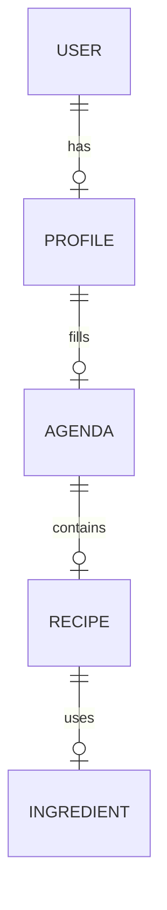

# NutriFlow : assistant culinaire intelligent et logistique

**NutriFlow** est une solution « full stack » visant à réduire la charge mentale liée à l’alimentation. Par rapport aux applis de recettes classiques, le projet combine **planification d’agenda**, **personnalisation (profil « ADN culinaire »)** et, à terme, **logistique d’achat (Click & Collect)**.

---

## Points forts (vision produit)

* **Profil ADN culinaire :** adapter recettes et portions au niveau (débutant → confirmé), aux contraintes (allergies) et aux objectifs nutritionnels (calories, macros).
* **Agenda hybride :** planifier la semaine en distinguant repas **à la maison**, **au restaurant** ou **à l’extérieur**, pour éviter d’acheter des ingrédients inutiles.
* **Moteur de recettes assisté par IA :** réécrire ou raccourcir les étapes selon le temps et le matériel disponibles (objectif métier ; l’appel IA sera orchestré côté **backend**).
* **Click & Collect :** rapprocher la liste de courses des catalogues drive (matching produits, scripts d’automatisation — voir dossier `integrations/`).
* **Expérience web / PWA :** interface claire, utilisable sur mobile ; la couche PWA est une **cible** du front (voir `FrontEnd/TACHES.md`).

---

## Stack technique actuelle (état du dépôt)

Le dépôt est un **monorepo** : API Java, client web en cours de montage, dossiers réservés pour Docker, mobile et intégrations externes.

| Zone | Technologie |
| :--- | :--- |
| **API** | [Spring Boot](https://spring.io/projects/spring-boot) **3.2.x**, **Java 21** — Web + Spring Data JPA ([`BackEnd/pom.xml`](BackEnd/pom.xml)) |
| **Base de données** | [PostgreSQL](https://www.postgresql.org/) (connexion JDBC / Hibernate ; pas de BaaS type Supabase dans la stack retenue) |
| **Front web** | [Tailwind CSS](https://tailwindcss.com/) v4 + PostCSS déjà présents ; **framework UI (ex. React / Next.js) à initialiser** — voir [`FrontEnd/TACHES.md`](FrontEnd/TACHES.md) |
| **Mobile** | Dossier [`Mobile/`](Mobile/) réservé (fichiers de suivi uniquement pour l’instant) |
| **Conteneurs** | Dossier [`Docker/`](Docker/) réservé |
| **Intégrations** | [`integrations/`](integrations/) — Click & Collect, **Open Food Facts** (voir ci-dessous), **Playwright** en option pour des PoC drive (respecter les CGU des enseignes) |
| **IA** | Appels **OpenAI** (ou équivalent) prévus **depuis le backend** (HTTP, quotas, timeouts) — pas LangChain imposé dans le code actuel |

> Un second `pom.xml` à la **racine** du dépôt existe mais ne correspond pas au module applicatif principal : l’API à lancer est sous **`BackEnd/`**.

### Données nutritionnelles de référence (produits)

Pour les **références alimentaires** sur produits emballés (énergie en kcal, protéines, glucides, lipides, sel, fibres, etc., en général **pour 100 g** ou par portion selon les champs disponibles), NutriFlow s’appuie sur la base [**Open Food Facts**](https://world.openfoodfacts.org/data).

* **Documentation officielle** : [Data, API, exports et conditions de réutilisation](https://world.openfoodfacts.org/data) (licence **Open Database License** pour la base ; lire les conditions avant toute réutilisation).
* **Usage prévu dans l’app** : appels à l’**API produit** (JSON/XML) **depuis le backend** (proxy, cache, en-tête `User-Agent` identifiable), pas depuis le navigateur — conformément aux bonnes pratiques décrites sur la page Data (en production, l’API live est pensée pour des consultations unitaires, par ex. liées à un scan réel ; les **exports** JSONL/CSV/Parquet servent aux usages de masse ou analytiques).
* **Matching drive** : le rapprochement avec les paniers Click & Collect reste dans [`integrations/`](integrations/) ; les données OFF enrichissent ou valident les produits (code-barres / EAN quand disponible).

---

## Structure métier des données (aperçu)



Les entités Java en cours de modélisation se trouvent sous [`BackEnd/src/main/java/com/nutriflow/backend/entities/`](BackEnd/src/main/java/com/nutriflow/backend/entities/).

---

## Suivi des tâches

Des fichiers **`TACHES.md`** décrivent le travail par zone. L’index central est [`SUIVI-TACHES.md`](SUIVI-TACHES.md).

---

## Roadmap de développement (alignée sur le repo)

### Phase 1 : fondations
- [ ] API Spring : sécurité (JWT ou session), validation, CORS avec l’URL du front.
- [ ] Schéma PostgreSQL stable (Flyway ou Liquibase).
- [ ] Front : choix et initialisation du framework + TypeScript + Tailwind + design system (couleurs maquette dans `FrontEnd/TACHES.md`).

### Phase 2 : agenda et recettes
- [ ] Vues planning / calendrier et suggestion de recettes (temps, macros).
- [ ] Endpoints métier + intégration IA côté serveur pour adaptation des recettes.

### Phase 3 : logistique et courses
- [ ] Agrégation des ingrédients et génération de liste de courses.
- [ ] Matching produits (EAN / libellés) avec enrichissement nutritionnel via [Open Food Facts](https://world.openfoodfacts.org/data) quand un code-barres est connu.
- [ ] Expérimentations Click & Collect dans `integrations/` (dont Playwright si pertinent).

### Phase 4 : robustesse et PWA
- [ ] PWA (manifest, service worker, hors-ligne lecture si possible).
- [ ] Rappels / notifications (selon besoin produit).
- [ ] Observabilité (Spring Boot Actuator, etc.).

---

## Installation locale

### Prérequis

- **JDK 21**, **Maven 3.x**
- **PostgreSQL** (ex. base `nutriflow_db` — ajuster selon votre instance)
- **Node.js** (pour le dossier `FrontEnd/` une fois le framework ajouté)

### 1. Cloner le dépôt

```bash
git clone https://github.com/<votre-org>/NutriChef-AI.git
cd NutriChef-AI
```

### 2. Base de données et backend

Configurer la connexion dans [`BackEnd/src/main/resources/application.properties`](BackEnd/src/main/resources/application.properties) (URL JDBC, utilisateur, mot de passe), puis :

```bash
cd BackEnd
./mvnw spring-boot:run
```

*(Si `mvnw` est absent, utilisez `mvn spring-boot:run` après `mvn wrapper:wrapper` ou installez le wrapper Maven du projet.)*

### 3. Front-end

Aujourd’hui, seules les dépendances outillage CSS sont déclarées. Après initialisation du framework (voir tâches front) :

```bash
cd FrontEnd
npm install
# puis la commande fournie par le boilerplate (ex. npm run dev)
```

Variables typiques côté front : URL de l’API (ex. `VITE_API_URL`, `NEXT_PUBLIC_API_URL`, etc. selon l’outil choisi).

### 4. Secrets (IA, drives)

Ne pas commiter de clés. Exemples de variables à définir en local ou en CI :

```env
OPENAI_API_KEY=...
# Identifiants drive / scripts : uniquement hors repo (vault, .env local ignoré par git)
```

---

## Principes de design (front)

* **Lisibilité :** beaucoup d’air, typographie claire.
* **Transitions :** animations discrètes si le projet adopte une librairie dédiée (ex. Framer Motion — optionnelle).
* **Accessibilité :** contrastes et zones tactiles suffisantes pour usage en cuisine.

---

## Note légale — Click & Collect

Toute automatisation de navigateur (ex. Playwright) sur un site marchand doit respecter les **conditions d’utilisation** de l’enseigne, limiter la fréquence des actions et traiter les identifiants comme des **secrets**.
